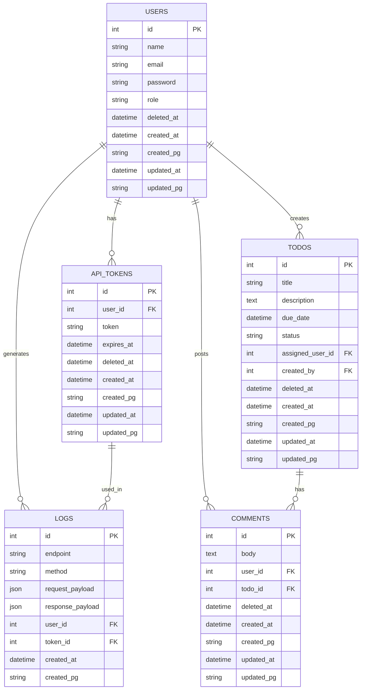

## ER diagram

```mermaid
erDiagram
    USERS {
        int id PK
        string name
        string email
        string password
        string role
        datetime deleted_at
        datetime created_at
        string created_pg
        datetime updated_at
        string updated_pg
    }

    API_TOKENS {
        int id PK
        int user_id FK
        string token
        datetime expires_at
        datetime deleted_at
        datetime created_at
        string created_pg
        datetime updated_at
        string updated_pg
    }

    TODOS {
        int id PK
        string title
        text description
        datetime due_date
        string status
        int assigned_user_id FK
        int created_by FK
        datetime deleted_at
        datetime created_at
        string created_pg
        datetime updated_at
        string updated_pg
    }

    COMMENTS {
        int id PK
        text body
        int user_id FK
        int todo_id FK
        datetime deleted_at
        datetime created_at
        string created_pg
        datetime updated_at
        string updated_pg
    }

    LOGS {
        int id PK
        string endpoint
        string method
        json request_payload
        json response_payload
        int user_id FK
        int token_id FK
        datetime created_at
        string created_pg
    }

    USERS ||--o{ API_TOKENS : "has"
    USERS ||--o{ TODOS : "creates"
    USERS ||--o{ COMMENTS : "posts"
    TODOS ||--o{ COMMENTS : "has"
    USERS ||--o{ LOGS : "generates"
    API_TOKENS ||--o{ LOGS : "used_in"
```
