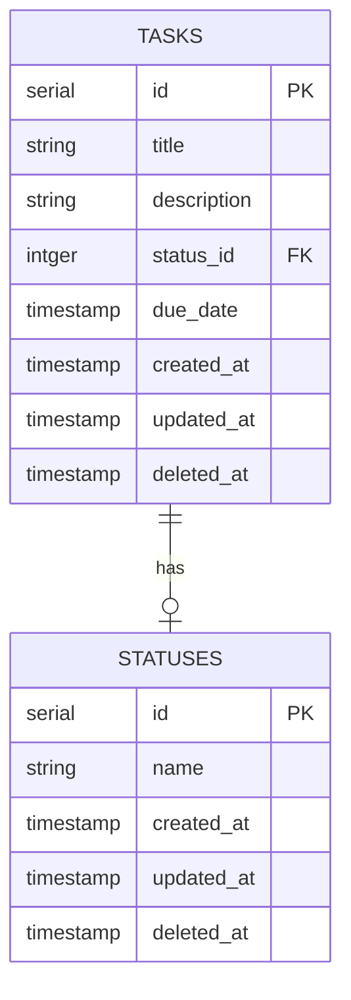

# todo-crud

## ER 図

```mermaid
erDiagram
    TASKS {
        serial id PK
        string title
        string description
        intger status_id FK
        timestamp due_date
        timestamp created_at
        timestamp updated_at
        timestamp deleted_at
    }
    STATUSES {
        serial id PK
        string name
        timestamp created_at
        timestamp updated_at
        timestamp deleted_at
    }

    TASKS ||--o| STATUSES : has
```
